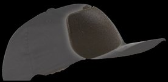
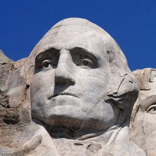
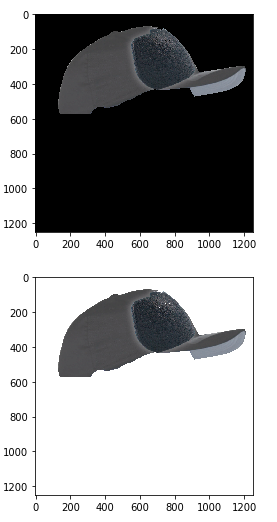
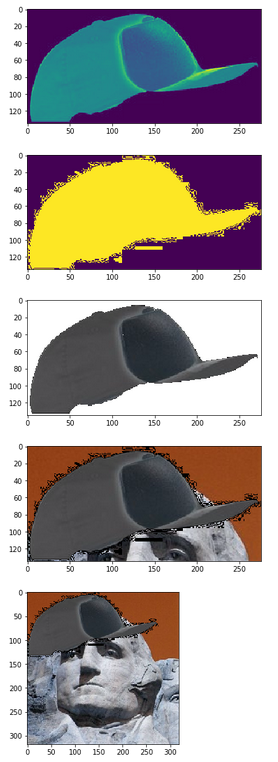
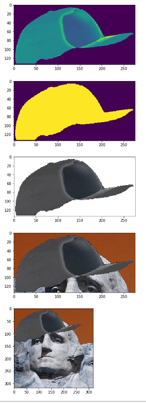
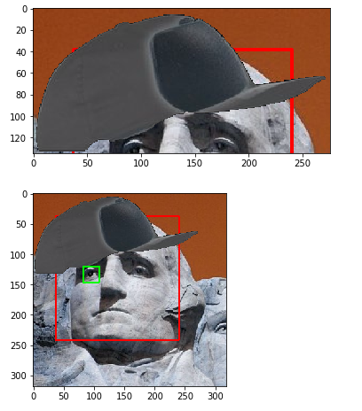
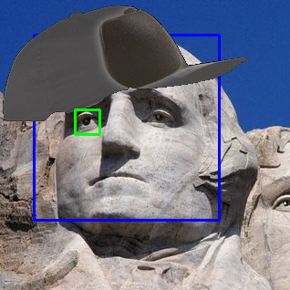

# OpenCV Mini Project
This project was made using OpenCV and TKinter (UI library)

## Demo
**NOTE: Haar Cascade's webcam has an image overlay for experimenting with, please see an indepth explanation below**

The goal of this project was to experiment with OpenCV's Thresholding (specifically Gaussian), GrabCut Foreground Extraction, and Haar Cascade. As well as wrapping it up with UI


## Project In Detail
* **Threshold (Gaussian)**: The inspiration of Gaussian Threshold operation was by the Firefighter AR : https://www.youtube.com/watch?v=PTfFtsUo7qY I wanted to see for myself if this particular Threshold would have benefitted Firefighters or any related activities

* **GrabCut Foreground Extraction**: This algorithm, provided by OpenCV made me think about applying image segmentation on an image or a live video feed. Overall this was to help me better understand how it works

* **Haar Cascade**: Using the exisiting Face and Eye cascades provided in https://github.com/opencv/opencv/tree/master/data/haarcascades, helped me build on top of my previous idea of what I've realized is called "Virtual Fitting". 
However based on **OpenCV's latest version**, it has taken out commands to train Haar Cascades.

## Experimenting with GrabCut and Haar Cascade
I've used **GrabCut** to cut around the hat, later manually resized it smaller in order to impose it on the desired image,

 




When using GrabCut, the final result shows a black background, I need it to be transparent:
```python
b, g, r = cv2.split(img_test_2)
rgba = [b,g,r, alpha]
dst = cv2.merge(rgba,4)
```



At first, when superimposing the hat on the face, it had excess noise when applying the following code:
```python
ret, mask = cv2.threshold(blur, 0, 255, cv2.THRESH_BINARY)
```



Further research in the documentation shows that an example of applying the gaus filter and otsu to remove excess noise : https://docs.opencv.org/3.4/d7/d4d/tutorial_py_thresholding.html

```python
blur = cv2.GaussianBlur(img2grey, (5,5), 0)
ret, mask = cv2.threshold(blur, 0, 255, cv2.THRESH_BINARY+cv2.THRESH_OTSU)
```



After the image has been finalized, I combine the modifications above to the Haar Cascade





## Final Thoughts
Overall a great learning experience, I later realized the training needed to able to perform similiarly to "Virtual Fitting". As well as avaliable third party cascades that would be able to do so.
